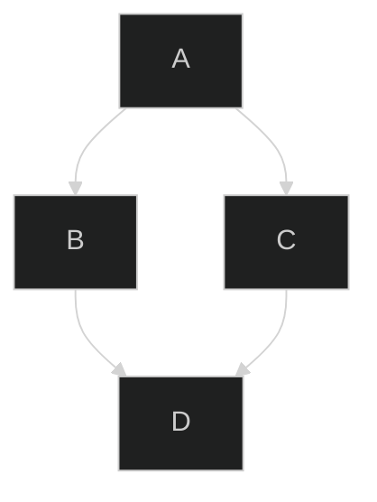

 @docusaurus/theme-mermaid 是 Docusaurus 將 [Mermain](https://mermaid.js.org/) 整併的流程圖套件，此套件可以生成 svg 圖檔。  
 供嵌入網頁使用


## theme-mermaid 流程圖套件
* [Docusaurus 參考說明](https://docusaurus.io/docs/next/markdown-features/diagrams)
* 註: 使用版本
    * "@docusaurus/core": "^3.7.0",
    * "@docusaurus/theme-mermaid": "^3.7.0",

## 套件安裝

```
    npm install @docusaurus/theme-mermaid
```

## 套件設定

__docusaurus.config.js__
* Theme 可選擇:
    * default: 
    * neutral: 列印黑白文件用
    * dark:  
    * forest: 綠色色調 
    * base: 欲客製化修改時選用 

config 下加上下列三項設定

```
    const config = {
      //簡易流程圖 meramaid 1/3
      themes: ['@docusaurus/theme-mermaid'],
      
      //簡易流程圖 meramaid 2/3
      markdown: {
        mermaid: true,
      },
    
      themeConfig:
        /** @type {import('@docusaurus/preset-classic').ThemeConfig} */
        ({
          //簡易流程圖 meramaid 3/3
          mermaid: {
            // 你可以在這裡設定 Mermaid 的選項 (optional)
             theme: {light: 'neutral', dark: 'forest'},
          },
      
      // omit....    
        }),
    };
```

## 基本語法 in mdx

* code block 封裝流程，語言選 mermaid
* graph TD: 縱向圖
* graph LR: 橫向圖

<pre>
    \`\`\`mermaid
    \%\%\{init: \{'theme':'dark'\}\}\%\%
    graph TD;
        A--\>B;
        A--\>C;
        B--\>D;
        C--\>D;
    \`\`\`
</pre>



## 基本語法 in jsx component

以 code block 封裝流程，語言選 mermaid

```
    import Mermaid from '@theme/Mermaid';
    
    <Mermaid
      value={`graph TD;
        A-->B;
        A-->C;
        B-->D;
        C-->D;`}
    /\>
```


## 參考資料
* [Mermain 官方網站](https://mermaid.js.org/)
* [Mermain Syntax Documentation](https://mermaid.js.org/intro/syntax-reference.html)
* [Theme Theme Configuration](https://mermaid.js.org/config/theming.html)
* [Mermaid Configuration Documentation](https://mermaid.js.org/config/configuration.html)
* [Mermaid 圖表線上範例](https://mermaid.live/)
* [Mermaid 學習紀錄](../Tools/Mermaid)


## 範例

<pre>    
    \`\`\`mermaid
    graph TD
        A\[開始\] --\> B\{判斷\};
        B -- 是 --\> C\[處理\];
        B -- 否 --\> D\[結束\];
        C --\> D;
    \`\`\`
</pre>    

    ```mermaid
    graph TD
        A[開始] --> B{判斷};
        B -- 是 --> C[處理];
        B -- 否 --> D[結束];
        C --> D;
    ```