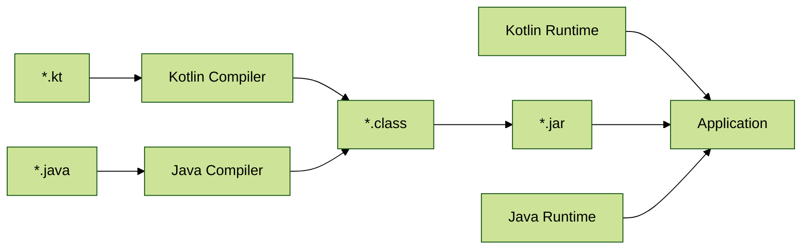

## Main method

```javascript
    //Java: 
    public static void main(String[] args) { }

   //Kotlin: 
   fun main(args: Array<String>)
```

## Import
* 混用: 
	* kotlin 中使用 <span style={{color: '#0044FF'}}>__import__</span> 關鍵字達成 import Java API
	* Java 中直接把 Kotlin <span style={{color: '#0044FF'}}>__當地三方 API 使用__</span>
	
|  Kotlin 引用 Java  | Java 引用 Kotlin  |
|----------|------------------------|
|類似 Java 中的 static import<br/>import java.util.Calendar;<br/>import 套件.函式<br/>import 套件.*|A: kt 中有 package 宣告<br/>java 中同一般 API 使用<br/>packagename.FileNameKt.method();<br/><br/>B: kt 中使用 Annotation, 定義FileNameKt, 或多個檔案用同一 Package 時,<br/>@file: JvmName("another")<br/>@file:JvmMultifileClass<br/>packagename.another.method();|

## Compile 順序

