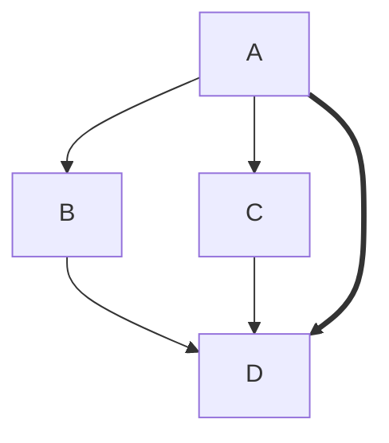
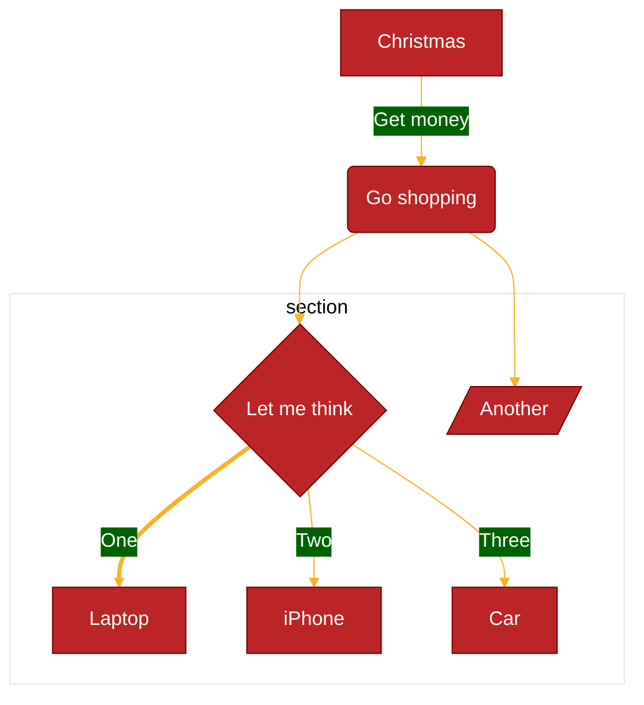
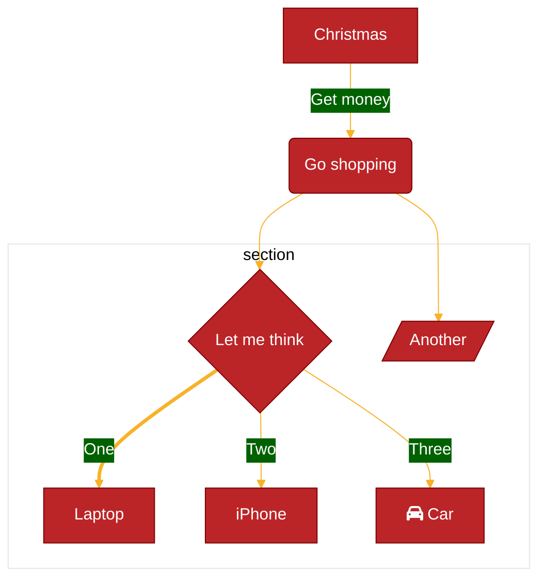

Mermaid 並非 Docusaurus 專用工具，可單獨使用並建立 svg/png 等圖檔  
下面範例可直接套用於 Docusaurus code block 之中  

## 測試版本
* Docusaurus version: 3.7.0
* Node version: v20.10.0
* mermaid: ^11.6.0
* @iconify-json/logos: ^1.2.4

## 參考資料
* [Mermain 官方網站](https://mermaid.js.org/)
* [Mermain Syntax Documentation](https://mermaid.js.org/intro/syntax-reference.html)
* [Theme Theme Configuration](https://mermaid.js.org/config/theming.html)
* [Mermaid Configuration Documentation](https://mermaid.js.org/config/configuration.html)
* [Mermaid 圖表線上範例](https://mermaid.live/)
* [Mermaid 學習紀錄](../Tools/Mermaid)
* [iconify](https://www.npmjs.com/search?q=iconify-json)


## 關於主題 Theme
* docusaurus.config.js 的 themeConfig.mermaid 下設定
* theme 選項:
    * default: 
    * neutral: 列印黑白文件用
    * dark:  
    * forest: 綠色色調 
    * base: 欲客製化修改時選用 

### 為單一圖表調整主題
* 在 mermaid 首行加上 init script 設定 __theme__ 屬性

~~~

~~~


### 為單一圖表設定專用主題
* 前提: theme 必須設為 base
* [不同圖表有不同的參數設定](https://mermaid.js.org/config/theming.html)
* 注意顏色僅能使用 __十六進位顏色__ 標示

__官網範例__

~~~

~~~





## 語法說明
* [官方語法說明](https://mermaid.js.org/syntax/flowchart.html)
* 排除 init block，次行指定圖表種類，而後依據各自語法繪製
* 不同圖表有各自的語法，基本上類似 emoticon，用鍵盤敲出指定外型便會產生對應外觀，例如
    * --\> 看似箭頭，繪出 arrow
    * ==\> 箭身較粗，繪出 boil darrow
    * \{\} 看似菱形，繪出 condition
    
## 於圖表上使用 Icons
1. 下載安裝圖示包 
1. [iconify](https://www.npmjs.com/search?q=iconify-json)下有多種類群依需求安裝
1. docusaurus.config.js 配置
1. 依據圖示語法指定 icon

### 安裝 Iconify 圖示包

__測試版本__

* Docusaurus version: 3.7.0
* Node version: v20.10.0
* mermaid: ^11.6.0
* @iconify-json/logos: ^1.2.4

此功能指的是 Cahrt 上的文字可以嵌入 iconify icons，但  
設定 themeConfig.mermaid.icon 出現 ValidationError, mermaid.icon is not allowed    
改用 plugin 編寫也無效(未出現 error, iconify path 如實呈現未轉換)    
改用 plugin 搭配 icon loader 編寫也無效  
總之換了多種寫法，應試出現衝突或是無法轉換  
放棄......

* 需安裝圖示包與相關工具套件

```bash
    npm install @docusaurus/theme-mermaid
    npm install mermaid
    npm install @iconify/utils
    npm install @iconify/jsonn
 
    npm install @iconify-json/logos
    npm install @iconify-json/mdi
    
```


## 使用建議
1. 先到線上 [Mermaid Live Editor](https://mermaid.live/edit) 選取所需的圖表種類
1. 依據線上範例修改成所需內容
1. 如此便無需記住所有圖表繪製語法